# HyprDuck Architecture

HyprDuck is a local-first document ingestion and agent-readable knowledge
workspace. The product starts with file parsing, but the architecture is built
around durable source records, materialized graph/wiki state, reviewable agent
updates, and local interfaces that other agents can consume.

This document describes the architecture that exists in the repository today.
It intentionally separates implemented behavior from product direction.

## System Goals

HyprDuck is designed around five constraints:

1. **Import must be local and permission-light.** PDF, DOCX, and DOC import must
   work without Screen Recording or Accessibility permissions.
2. **Original source truth must be preserved.** Imported source files and
   generated markdown/page artifacts are stored as durable local records.
3. **Derived knowledge must stay auditable.** Nodes, claims, relations, wiki
   pages, memories, and review items are materialized from explicit events and
   provider outputs, not hidden UI state.
4. **Agents should read structured context, not scrape the UI.** The Rust engine
   and MCP server expose search, context packs, graph snapshots, source reads,
   wiki reads, and policy-controlled proposals.
5. **Provider output is a candidate, not source truth.** Provider-generated graph
   state is parsed, normalized, validated, written with run artifacts, and
   replayed through the materialized brain repository.

## Repository Map

```text
HyprDuck/
├── apps/
│   ├── desktop/                         # Active Electron desktop shell
│   │   ├── main.cjs                     # Main process, IPC, engine runtime queue
│   │   ├── preload.cjs                  # Safe renderer bridge
│   │   ├── src/App.tsx                  # App shell, import, settings, history, graph workspace
│   │   └── src/features/workspace/      # Materialized graph UI adapter and canvas
│   └── site/                            # Public Astro site / web preview assets
├── crates/
│   ├── hyprduck-engine                  # Core Rust runtime and domain logic
│   ├── hyprduck-engine-client           # Subprocess client used by CLI/MCP-style callers
│   ├── hyprduck-engine-types            # Shared command, response, graph, brain schemas
│   ├── hyprduck-cli                     # CLI, TUI, MCP server, eval harness
│   └── hyprduck-knowledge               # Shared knowledge/brain record types
├── docs/                                # Architecture, MCP, model task matrix, graph docs
├── schemas/                             # JSON schema contracts for external consumers
└── scripts/                             # Engine sync/build helpers for Electron
```

## High-Level Architecture

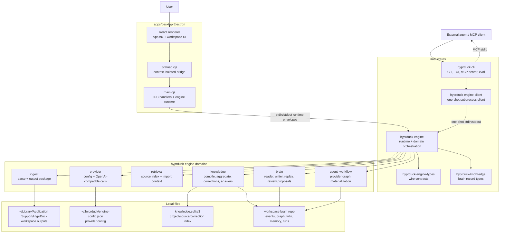

There are two primary execution surfaces:

- **Electron runtime mode:** `apps/desktop/main.cjs` starts
  `hyprduck-engine serve`, keeps the subprocess alive, sends request envelopes
  with UUIDv7 IDs, and receives command responses plus parse progress events.
- **CLI one-shot mode:** `hyprduck-cli` and `hyprduck-engine-client` spawn the
  engine per command, send a single JSON request on stdin, and read one JSON
  response from stdout.

The engine itself owns the domain contracts. The UI should not package output,
persist provider settings, or mutate the graph directly.

## Desktop Runtime

The active desktop shell is Electron under `apps/desktop`.

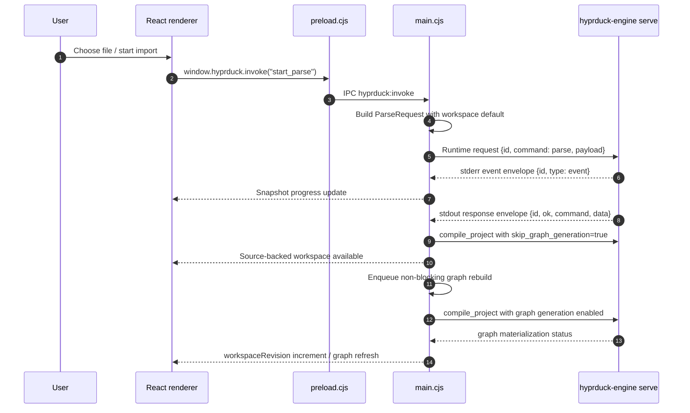

### Main Process Responsibilities

`apps/desktop/main.cjs` owns:

- window creation and Electron lifecycle
- IPC command routing through `hyprduck:invoke`
- file picker filters for PDF, DOCX, and DOC
- engine subprocess lifecycle in `EngineRuntime`
- parse progress snapshot publication
- local artifact opening/revealing
- provider config load/save/validation routing
- workspace graph snapshot reads
- review item resolution
- non-blocking workspace graph rebuild queue

The main process keeps a small in-memory snapshot for the renderer:

```text
activeJob
progressLog
lastResult
lastProjectId
lastWorkspaceId
lastSourceId
lastSourceManifestPath
workspaceRevision
```

This snapshot is UI state only. Durable product state lives in engine-managed
files and the project store.

### Renderer Responsibilities

`apps/desktop/src/App.tsx` owns:

- shell navigation between Knowledge and Settings
- import panel and markdown preview
- provider/model settings UI
- readiness and validation status display
- graph workspace loading and fallback display
- history/review popover
- proposing and resolving brain updates through IPC

`apps/desktop/src/features/workspace/` adapts the latest materialized graph
snapshot into the UI envelope used by `GraphWorkspace`. This keeps graph canvas
code separate from engine wire contracts.

## Rust Engine Runtime

The engine supports two process protocols.

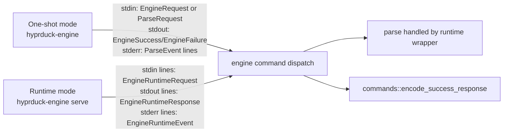

Runtime mode requires request IDs to be UUIDv7 strings. Parse events are scoped
to the active request ID and emitted on stderr as runtime event envelopes. This
lets Electron multiplex progress logs without restarting the engine process.

Non-parse commands are dispatched through `crates/hyprduck-engine/src/commands/mod.rs`.
Parse commands are handled specially so debug request/result artifacts and parse
progress events can be written consistently.

## Engine Command Surface

The shared command schema lives in `crates/hyprduck-engine-types/src/lib.rs`.

```mermaid
flowchart TB
  EngineCommand["EngineCommand"]

  EngineCommand --> Import["Import and project workflow"]
  Import --> Parse["Parse"]
  Import --> CompileProject["CompileProject"]
  Import --> LoadProject["LoadProject"]
  Import --> ApplyCorrection["ApplyCorrection"]
  Import --> AnswerProject["AnswerProject"]

  EngineCommand --> BrainReads["Brain reads"]
  BrainReads --> SearchBrain["SearchBrain"]
  BrainReads --> ReadSource["ReadSource"]
  BrainReads --> ReadWikiPage["ReadWikiPage"]
  BrainReads --> ReadNode["ReadNode"]
  BrainReads --> ReadRecentEvents["ReadRecentEvents"]
  BrainReads --> ReadGraphHistory["ReadGraphHistory"]
  BrainReads --> ReadGraphSnapshot["ReadGraphSnapshot"]
  BrainReads --> GetContextPack["GetContextPack"]
  BrainReads --> GetBrainHealth["GetBrainHealth"]

  EngineCommand --> BrainWrites["Brain writes and replay"]
  BrainWrites --> ProposeBrainUpdate["ProposeBrainUpdate"]
  BrainWrites --> ListBrainReviewItems["ListBrainReviewItems"]
  BrainWrites --> ResolveBrainReviewItem["ResolveBrainReviewItem"]
  BrainWrites --> ReconstructBrain["ReconstructBrain"]

  EngineCommand --> ProviderRuntime["Provider and runtime"]
  ProviderRuntime --> LoadConfig["LoadConfig"]
  ProviderRuntime --> SaveConfig["SaveConfig"]
  ProviderRuntime --> ValidateProvider["ValidateProvider"]
  ProviderRuntime --> ListProviderModels["ListProviderModels"]
  ProviderRuntime --> CheckReadiness["CheckReadiness"]
```

The command surface intentionally has both product-facing project commands and
agent-facing brain commands. Project commands support the desktop workflow.
Brain commands support graph/wiki readers, MCP, reviewable proposals, and
replay/debug tooling.

## Ingest and Output Package Flow

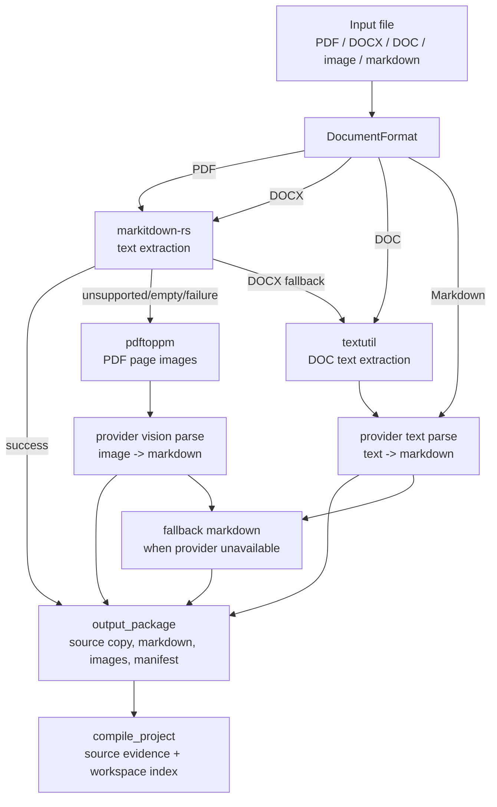

The ingest domain is implemented in:

- `crates/hyprduck-engine/src/domains/ingest/parse.rs`
- `crates/hyprduck-engine/src/domains/ingest/output_package.rs`
- `crates/hyprduck-engine/src/domains/ingest/markdown_queue.rs`

### Output Package Contents

A successful parse writes a source-backed package under the workspace output
root. In Electron, the root is `~/Library/Application Support/HyprDuck`.

```text
<output-root>/
└── default/
    ├── sources/
    │   └── <source-id>/
    │       └── original file copy
    ├── artifacts/
    │   └── <source-id>/
    │       ├── source-manifest.json
    │       ├── output.md
    │       ├── pages/
    │       ├── images/
    │       ├── provider-graph-context.json
    │       └── provider-graph-materialization.json
    ├── source-index/
    │   ├── source-chunks.jsonl
    │   └── source-chunks-manifest.json
    ├── graph/
    ├── memory/
    ├── wiki/
    ├── events/
    ├── reviews/
    ├── runs/
    └── state/
```

The manifest is the bridge between raw parsing and knowledge materialization. It
records workspace ID, source ID, original path, copied source path, markdown
path, artifact root, page artifacts, status, and source metadata.

## Provider Architecture

Provider code lives in `crates/hyprduck-engine/src/domains/provider`.

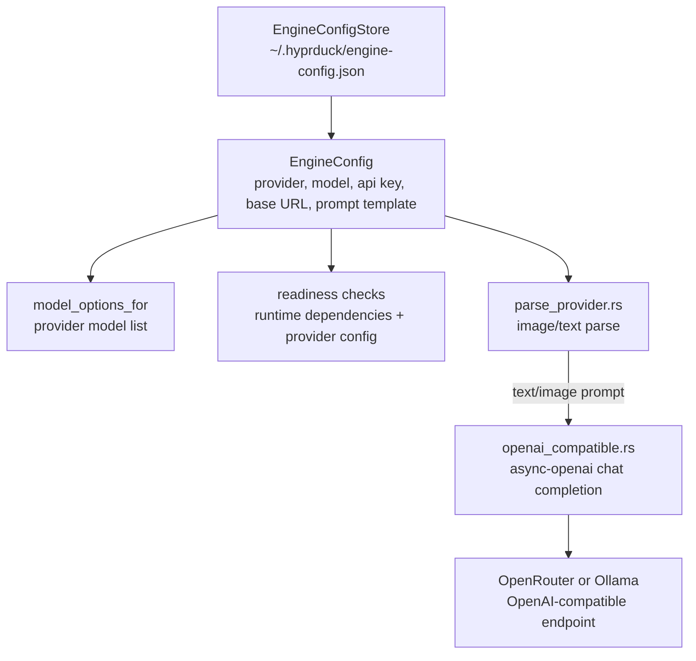

The implemented provider enum currently includes:

- `OpenRouter`
- `Ollama`

Both use an OpenAI-compatible chat completion request shape through
`async-openai`. Ollama is intentionally allowed without an API key. OpenRouter
requires an API key.

Provider output is used in two places:

- parse-time markdown generation for image/text input
- graph materialization through JSON schema response formats

When a provider is unavailable for parse-time work, the engine returns fallback
markdown rather than blocking local import. Graph generation, however, records a
skipped or failed provider graph materialization report.

## Knowledge Compile Flow

After parsing, HyprDuck compiles the markdown package into a source-backed
workspace project.

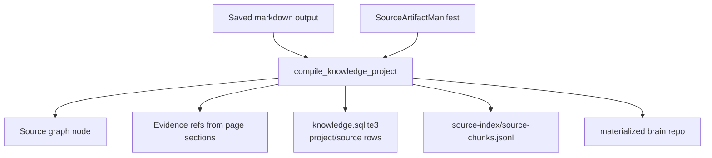

The deterministic compiler intentionally keeps derived knowledge minimal. It
creates source nodes, evidence refs, source-backed project snapshots, and
answers that tell the user the source evidence is ready. Durable concepts,
claims, relations, wiki pages, and cross-source links are delegated to the
provider graph workflow or reviewable proposals.

This boundary matters: deterministic ingest prepares source truth; agent/provider
work proposes or materializes derived knowledge.

## Source Index and Retrieval Context

The retrieval domain builds a compact context for provider graph generation and
agent reads.

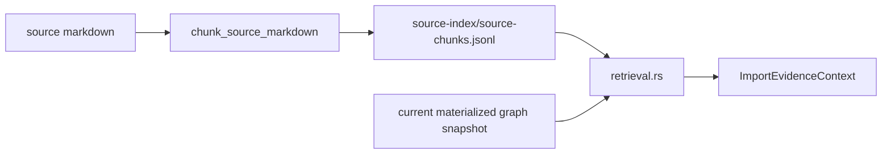

The import context includes:

- new source chunks
- retrieved old source/wiki/memory evidence
- a compact workspace source outline
- allowed source and evidence refs
- graph context from the latest materialized snapshot

Provider graph proposals and materialized graph outputs are expected to cite
only context-backed source/evidence IDs.

## Brain Repository and Materialized State

The local brain repository is the durable read model for agents and the desktop
graph UI.

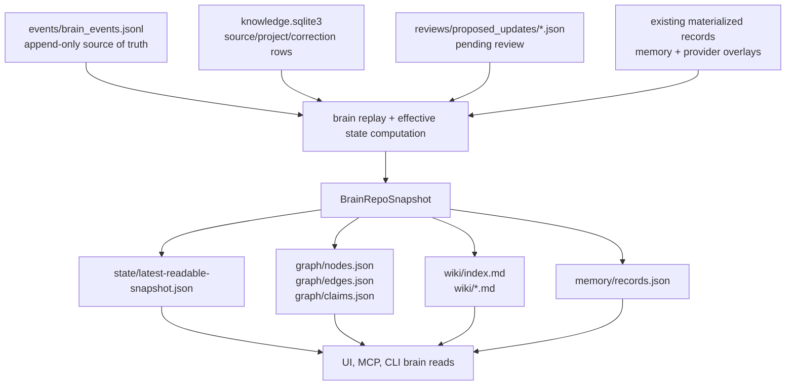

The latest-readable marker is the loading contract. Readers trust the materialized
files only when `state/latest-readable-snapshot.json` resolves to a completed
graph materialization event for the requested workspace. This avoids half-written
graph/wiki state becoming the UI or MCP read surface.

## Provider Graph Materialization

Provider graph materialization is implemented under
`crates/hyprduck-engine/src/domains/agent_workflow`.

The current workflow is two-stage:

1. **Source-local graph build:** generate graph records grounded in the imported
   source and its evidence.
2. **Workspace linking:** add relation-only cross-source links between the new
   source graph and the existing workspace graph.

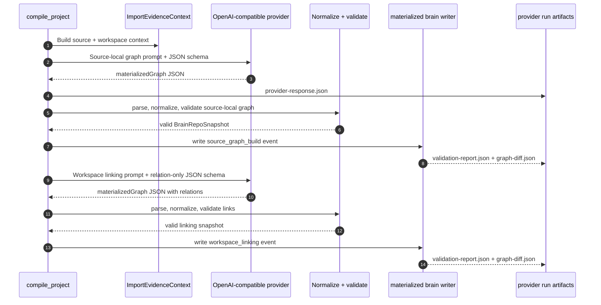

### Provider Run Artifacts

Each graph generation stage writes inspectable run artifacts:

```text
runs/
└── provider-source-graph-<uuid>/
    ├── provider-response.json
    ├── validation-report.json
    └── graph-diff.json

runs/
└── provider-workspace-linking-<uuid>/
    ├── provider-response.json
    ├── validation-report.json
    └── graph-diff.json
```

The source artifact root also records:

```text
provider-graph-context.json
provider-graph-materialization.json
```

The materialization report stores status, provider/model, input fingerprint,
node/relation/claim/memory counts, run IDs, skipped reason, and error message.

### Reuse and Fingerprints

Provider graph reports are reusable only when the previous report is linked and
the input fingerprint matches:

- workspace ID
- source ID
- manifest update timestamp
- markdown hash
- provider slug
- model ID
- schema versions
- prompt version
- baseline snapshot marker

This prevents stale provider output from being reused after source or workspace
state changes.

## Reviewable Brain Writes

HyprDuck distinguishes safe memory-style writes from risky graph truth writes.

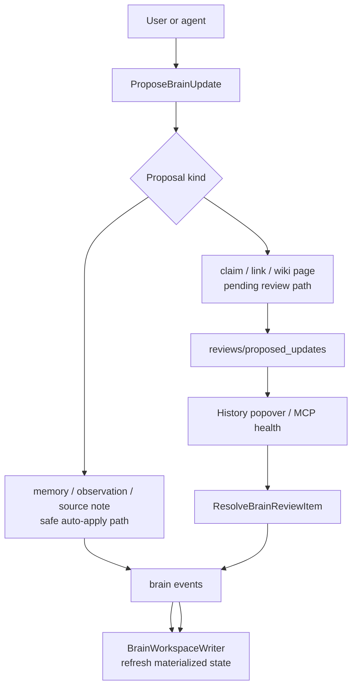

Desktop users can resolve pending review items from the History popover.
External agents can propose changes through MCP, but they cannot accept risky
review items or overwrite source truth.

## MCP Brain Server

`hyprduck-cli` exposes an MCP stdio server through:

```bash
hyprduck mcp serve
```

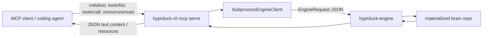

MCP read tools include:

- `search_brain`
- `get_context_pack`
- `read_source`
- `read_wiki_page`
- `read_node`
- `read_recent_events`
- `read_graph_snapshot`
- `read_health`

MCP proposed-write tools include:

- `propose_memory`
- `propose_claim`
- `propose_link`
- `append_observation`
- `add_source_note`
- `request_consolidation`

MCP resources expose graph snapshots and wiki pages through `hyprduck://brain/*`
URIs.

## Storage Contracts

HyprDuck uses three storage layers.

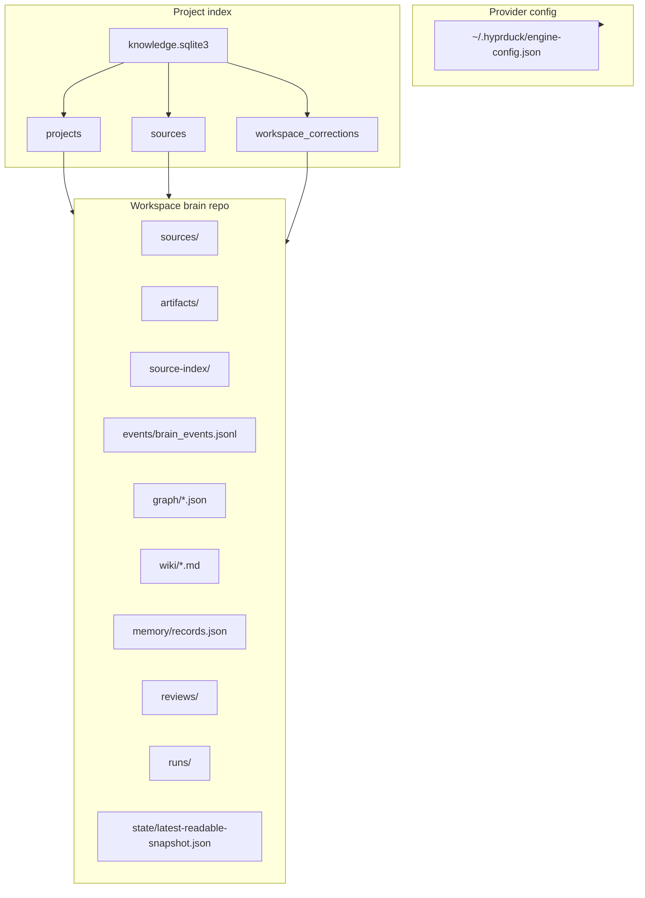

### Environment Overrides

The engine supports environment overrides for tests and local workflows:

- `HYPRDUCK_OUTPUT_DIR`: output/workspace root
- `HYPRDUCK_PROJECT_STORE`: SQLite project store path
- `HYPRDUCK_CONFIG_DIR`: provider config directory
- `HYPRDUCK_DISABLE_PROVIDER_GRAPH`: disables provider graph generation

These are process-wide settings. Rust tests that mutate them must be serialized
with a shared lock because Rust test execution is parallel by default.

## Read Model Consistency

Materialized graph/wiki state is written through `write_materialized_brain_repo`.
That function computes an effective snapshot before persistence:

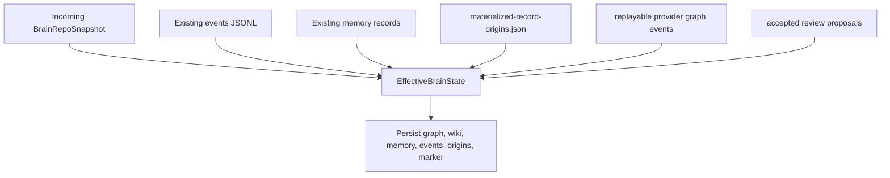

This is why writes must be careful: the final disk state can include preserved
provider overlays, accepted proposals, existing memory records, and newly
computed deterministic source state.

## Failure and Fallback Boundaries

HyprDuck is designed to keep import useful even when advanced graph generation
fails.

| Boundary | Failure behavior |
| --- | --- |
| Provider unavailable during parse | Return fallback markdown with extracted text or image placeholder. |
| Provider unavailable during graph generation | Write provider graph materialization report with skipped reason. |
| Source graph generation fails | Report graph generation failure; source markdown/package remains available. |
| Workspace linking fails after source graph materialization | Keep source-local graph and report partial status. |
| Materialized marker missing/stale | Readers fall back to latest completed materialized event when possible. |
| Engine runtime subprocess exits | Electron fails active/queued runtime requests and can restart on next command. |
| Reviewable risky write | Store pending proposal; do not mutate trusted graph until accepted. |

## Testing Strategy

The Rust verification command used for the core workspace is:

```bash
cargo test -p hyprduck-engine-types -p hyprduck-engine-client -p hyprduck-engine -p hyprduck-cli
```

The Electron IA/contract tests are:

```bash
bun run --cwd apps/desktop test:ia
```

Important test categories:

- engine type serialization round trips
- runtime request/response envelopes
- fixture round trips for PDF/DOCX/DOC
- output package fallback behavior
- brain materialization and replay invariants
- provider graph schema/validation/materialization
- workspace deletion and correction replay
- MCP tool/resource protocol behavior
- desktop IA source-of-truth assertions

## Current Implementation Notes

These details are current as of this document:

- The active desktop app is Electron, not Tauri.
- The engine provider enum currently implements OpenRouter and Ollama.
- OpenRouter and Ollama both use the OpenAI-compatible client path.
- The deterministic compiler creates source/evidence state; derived knowledge is
  agent/provider-maintained.
- The desktop import path compiles source evidence first and queues provider
  graph generation asynchronously so the UI can show imported source state before
  graph materialization finishes.
- MCP exposes read tools and proposed-write tools. It does not expose review
  acceptance for external agents.
- `events/brain_events.jsonl` remains the audit/source-of-truth path for graph
  and wiki changes; `graph/*.json`, `wiki/*.md`, and `memory/records.json` are
  materialized read models.

## Design Implications

HyprDuck should continue to keep these boundaries strict:

- UI commands should route through one engine-backed service path.
- File import should not depend on capture permissions.
- Provider settings should be shared across parsing and graph workflows.
- Output markdown should retain references to saved image/page artifacts when
  visual parsing is used.
- Provider graph output should remain schema-constrained and validated.
- Reviewable writes should stay auditable and source-backed.
- Agent-facing interfaces should prefer structured context packs and graph reads
  over UI scraping.
