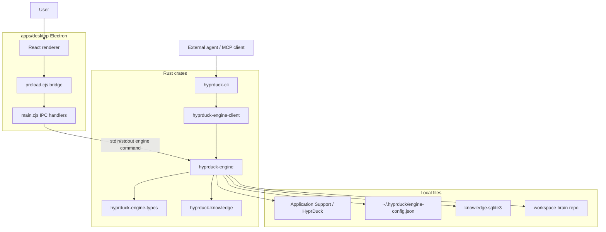

# HyprDuck Architecture

HyprDuck is a local-first document ingestion and agent-readable knowledge
workspace. The active product wedge is file parsing: import PDF, DOCX, or DOC,
convert pages into local artifacts, generate markdown, and materialize a
source-backed graph/wiki workspace that agents can read.

This document describes the current repository behavior after removing the old
write-gating layer.

## System Goals

1. Import must be local and permission-light. PDF, DOCX, and DOC import works
   without Screen Recording or Accessibility permissions.
2. Imported files and generated markdown/page artifacts are stored as durable
   local records.
3. Derived knowledge is inspectable. Nodes, claims, relations, wiki pages,
   memories, and health events are produced by explicit engine flows.
4. Agents read structured context rather than scraping the UI. The Rust engine
   and MCP server expose search, context packs, graph snapshots, source reads,
   wiki reads, event history, and health.
5. Provider-generated graph output is parsed, normalized, validated, written
   with run artifacts, and materialized into the local workspace.

## Repository Map

```text
HyprDuck/
├── apps/
│   ├── desktop/                         # Active Electron desktop shell
│   │   ├── main.cjs                     # Main process, IPC, engine runtime queue
│   │   ├── preload.cjs                  # Safe renderer bridge
│   │   ├── src/App.tsx                  # App shell, import, settings, history, graph workspace
│   │   └── src/features/workspace/      # Materialized graph UI adapter and canvas
│   └── site/                            # Public Astro site / web preview assets
├── crates/
│   ├── hyprduck-engine                  # Core Rust runtime and domain logic
│   ├── hyprduck-engine-client           # Subprocess client used by CLI and MCP callers
│   ├── hyprduck-engine-types            # Shared command, response, graph, brain schemas
│   ├── hyprduck-cli                     # CLI, TUI, MCP server, eval harness
│   └── hyprduck-knowledge               # Shared knowledge/brain record types
├── docs/                                # Architecture, MCP, model task matrix, graph docs
├── schemas/                             # JSON schema contracts for external consumers
└── scripts/                             # Engine sync/build helpers for Electron
```

## Runtime Flow



## Engine Domains

- `ingest`: copies source files, renders pages, runs parsing, and writes output
  packages.
- `provider`: loads AI configuration and calls OpenRouter-hosted models or
  Ollama-compatible local endpoints through the OpenAI-compatible chat client.
- `retrieval`: builds local source indexes and import context.
- `knowledge`: compiles source-backed project views, applies corrections, and
  answers workspace questions using citations.
- `agent_workflow`: generates and validates provider graph output, then
  materializes graph/wiki state.
- `brain`: reads graph/wiki/source/event artifacts, reconstructs graph state,
  writes corrections, and reports health.

## Engine Commands

The shared engine contract lives in `crates/hyprduck-engine-types/src/lib.rs`.
The active command surface includes:

- Parse and project commands: `Parse`, `LoadProject`, `CompileProject`,
  `ApplyCorrection`, `AnswerProject`.
- Provider/config commands: `LoadConfig`, `SaveConfig`, `ValidateProvider`,
  `CheckReadiness`, `GetModelsForProvider`.
- Brain read commands: `SearchBrain`, `GetContextPack`, `ReadSource`,
  `ReadWikiPage`, `ReadNode`, `ReadRecentEvents`, `ReadGraphHistory`,
  `ReadGraphSnapshot`, `ReconstructBrain`, `GetBrainHealth`.

## Desktop Boundary

The active desktop shell is `apps/desktop`.

- `main.cjs` owns Electron IPC and engine process calls.
- `preload.cjs` exposes a narrow `window.hyprduck.invoke/listen` bridge.
- `App.tsx` owns import, settings, progress, history, and graph workspace state.
- `src/features/workspace` adapts materialized graph snapshots into the React
  graph workspace.

The primary import flow must not depend on Screen Recording or Accessibility
permissions.

## Workspace Artifacts

A workspace is materialized under the local HyprDuck application-support root:

```text
brain-manifest.json
events/
  brain_events.jsonl
graph/
  nodes.json
  edges.json
  claims.json
  evidence.json
memory/
  records.json
runs/
  <provider-run-id>/
state/
  latest-readable-snapshot.json
wiki/
  index.md
  *.md
```

`events/brain_events.jsonl` is the append-only event log. Graph, memory, and
wiki files are read models rebuilt from materialization and correction events.
`state/latest-readable-snapshot.json` is the stable loading marker for desktop,
MCP, and resource reads.

## MCP Surface

`hyprduck mcp serve` exposes read/search tools plus controlled mutating tools:

- `import_source`
- `get_context_pack`
- `read_context_pack`
- `search_documents`
- `search_brain`
- `read_source`
- `read_page_evidence`
- `read_wiki_page`
- `read_node`
- `read_recent_events`
- `read_graph_history`
- `read_graph_snapshot`
- `read_health`
- `write_propose`
- `write_commit`
- `write_commit_all`
- `write_list`
- `write_reject`

MCP tools return JSON as text content and preserve source, evidence, graph,
memory, and event IDs for agent use.

## Verification

Core checks:

```bash
cargo test -p hyprduck-engine-types -p hyprduck-engine-client -p hyprduck-engine -p hyprduck-cli
pnpm --dir apps/desktop build
```
