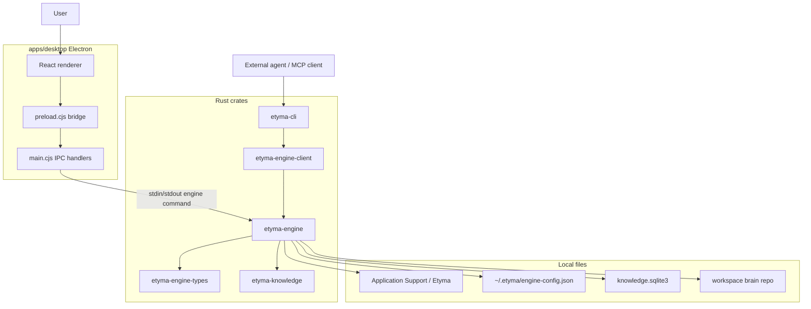

# Etyma Architecture

Etyma is a local-first document ingestion and agent-readable knowledge
workspace. The active product wedge is file parsing: import PDF, DOCX, or DOC,
convert pages into local artifacts, generate markdown, and materialize a
source-backed graph/wiki workspace that agents can read.

This document describes the current repository behavior after removing the old
write-gating layer.

## System Goals

1. Import must be local and permission-light. PDF, DOCX, and DOC import works
   without Screen Recording or Accessibility permissions.
2. Imported files and generated markdown/page artifacts are stored as durable
   local records.
3. Derived knowledge is inspectable. Nodes, claims, relations, wiki pages,
   memories, and health events are produced by explicit engine flows.
4. Agents read structured context rather than scraping the UI. The Rust engine
   and MCP server expose search, context packs, graph snapshots, source reads,
   wiki reads, event history, and health.
5. Graph output has two supported materialization paths: provider-generated
   graph output through OpenRouter/Ollama, and agent-generated graph patches
   submitted over MCP. Both paths validate source/evidence refs before writing
   GraphQLite graph state.

## Repository Map

```text
Etyma/
├── apps/
│   ├── desktop/                         # Active Electron desktop shell
│   │   ├── main.cjs                     # Main process, IPC, engine runtime queue
│   │   ├── preload.cjs                  # Safe renderer bridge
│   │   ├── src/App.tsx                  # App shell, import, settings, history, graph workspace
│   │   └── src/features/workspace/      # Materialized graph UI adapter and canvas
│   └── site/                            # Public Astro site / web preview assets
├── crates/
│   ├── etyma-engine                  # Core Rust runtime and domain logic
│   ├── etyma-engine-client           # Subprocess client used by CLI and MCP callers
│   ├── etyma-engine-types            # Shared command, response, graph, brain schemas
│   ├── etyma-cli                     # CLI, TUI, MCP server, eval harness
│   └── etyma-knowledge               # Shared knowledge/brain record types
├── docs/                                # Architecture, MCP, model task matrix, graph docs
├── schemas/                             # JSON schema contracts for external consumers
└── scripts/                             # Engine sync/build helpers for Electron
```

## Runtime Flow



## Engine Domains

- `ingest`: copies source files, renders pages, runs parsing, and writes output
  packages.
- `provider`: loads AI configuration and calls OpenRouter-hosted models or
  Ollama-compatible local endpoints through the OpenAI-compatible chat client.
- `retrieval`: builds local source indexes and import context.
- `knowledge`: compiles source-backed project views, applies corrections, and
  answers workspace questions using citations.
- `agent_workflow`: generates and validates provider graph output, then
  materializes graph/wiki state.
- `brain`: reads graph/wiki/source/event artifacts, reconstructs graph state,
  writes corrections, and reports health.

## Graph Materialization Paths

Provider graph generation remains the engine-owned AI calling path. During
import or graph retry, the Rust engine calls the configured OpenRouter-hosted
model or local Ollama-compatible endpoint, normalizes provider output, validates
source/evidence references, writes provider run artifacts, and commits the
materialized graph/wiki snapshot.

Agent graph patching is the MCP-owned agent path. External agents such as Codex,
Claude Code, or a local PI agent read source/evidence/context through MCP using
their own model runtime, then call `graph_patch_apply` with a
`etyma.graph_patch.v1` payload. Etyma does not call that model. The engine
validates the patch schema, source scope, evidence refs, relation endpoints,
claim refs, and wiki refs, then auto-applies the valid patch through the same
GraphQLite snapshot commit path and records an audit event with
`operationType: agent_graph_patch_apply`.

Both paths preserve the desktop graph canvas as the inspection surface and keep
local paths redacted in agent-facing MCP output unless the caller explicitly
requests local path disclosure.

## Engine Commands

The shared engine contract lives in `crates/etyma-engine-types/src/lib.rs`.
The active command surface includes:

- Parse and project commands: `Parse`, `LoadProject`, `CompileProject`,
  `ApplyCorrection`, `AnswerProject`.
- Provider/config commands: `LoadConfig`, `SaveConfig`, `ValidateProvider`,
  `CheckReadiness`, `GetModelsForProvider`.
- Brain read commands: `SearchBrain`, `GetContextPack`, `ReadSource`,
  `ReadWikiPage`, `ReadNode`, `ReadRecentEvents`, `ReadGraphHistory`,
  `ReadGraphSnapshot`, `ReconstructBrain`, `GetBrainHealth`.
- Agent graph write command: `ApplyGraphPatch`.

## Desktop Boundary

The active desktop shell is `apps/desktop`.

- `main.cjs` owns Electron IPC and engine process calls.
- `preload.cjs` exposes a narrow `window.etyma.invoke/listen` bridge.
- `App.tsx` owns import, settings, progress, history, and graph workspace state.
- `src/features/workspace` adapts materialized graph snapshots into the React
  graph workspace.

The primary import flow must not depend on Screen Recording or Accessibility
permissions.

## Workspace Artifacts

A workspace is materialized under the local Etyma application-support root:

```text
brain-manifest.json
events/
  brain_events.jsonl
graph/
  nodes.json
  edges.json
  claims.json
  evidence.json
memory/
  records.json
runs/
  <provider-run-id>/
state/
  latest-readable-snapshot.json
wiki/
  index.md
  *.md
```

`events/brain_events.jsonl` is the append-only event log. Graph, memory, and
wiki files are read models rebuilt from materialization and correction events.
`state/latest-readable-snapshot.json` is the stable loading marker for desktop,
MCP, and resource reads.

## Refactor Pattern Criteria

Etyma uses named boundaries only when they protect a real contract.

- Command handlers stay as explicit `EngineRequest`/`EngineCommand` enum
  dispatch. Handler bodies may move into family modules, such as graph, write,
  read, provider, or ingest, but the public command names and response shapes
  remain grep-friendly and schema-backed.
- A generic Command trait is not part of the current engine boundary. Add one
  only if multiple command families need shared middleware for validation,
  authorization, tracing, or retry semantics that cannot stay clear in the
  exhaustive enum dispatcher.
- Builders are for artifacts with cross-field invariants: schema versions,
  required IDs, provider route and local/hosted disclosure, content hashes,
  warnings, or budget metadata. Plain wire DTOs should remain plain serde
  structs.
- Projectors are event-to-read-model materializers. The current named projector
  boundary is graph/wiki read-model projection from `BrainRepoSnapshot` into
  graph JSON, wiki markdown, and the latest-readable marker.
- Visitor is deferred. Do not introduce it until graph/wiki/claim traversal has
  repeated passes over a stable model that cannot be kept clear with direct
  functions.
- Strategy/Adapter boundaries are allowed for real variation points, such as
  OpenRouter/Ollama provider calls, parser execution, retrieval/search, and
  evidence selection. Do not add a provider plugin framework or imply direct
  OpenAI/Anthropic support.

Current strategy audit:

| Area | Boundary decision |
| --- | --- |
| Provider calls | Keep `ProviderKind` enum dispatch. OpenRouter and Ollama share the OpenAI-compatible chat adapter; unknown slugs remain preserved but unsupported. |
| Parser execution | Keep direct format dispatch in ingest parsing. MarkItDown, PDF rendering, visual parsing, and text parsing are concrete paths, not plugin strategies yet. |
| Retrieval/search | Keep deterministic local query and scoring functions. Add a trait only if multiple retrieval engines need the same call contract. |
| Evidence selection | Keep current context-pack construction functions until budget or ranking policy varies independently of retrieval. |

## MCP Surface

`etyma mcp serve` exposes read/search tools plus controlled mutating tools:

- `import_source`
- `import_status`
- `import_cancel`
- `import_retry_graph`
- `get_context_pack`
- `read_context_pack`
- `search_documents`
- `search_brain`
- `read_source`
- `read_page_evidence`
- `read_wiki_page`
- `read_node`
- `read_recent_events`
- `read_graph_history`
- `read_graph_snapshot`
- `read_health`
- `graph_patch_apply`
- `write_propose`
- `write_commit`
- `write_commit_all`
- `write_list`
- `write_reject`

MCP tools return JSON as text content and preserve source, evidence, graph,
memory, and event IDs for agent use.

## Verification

Core checks:

```bash
cargo test -p etyma-engine-types -p etyma-engine-client -p etyma-engine -p etyma-cli
bun run --cwd apps/desktop build
```
