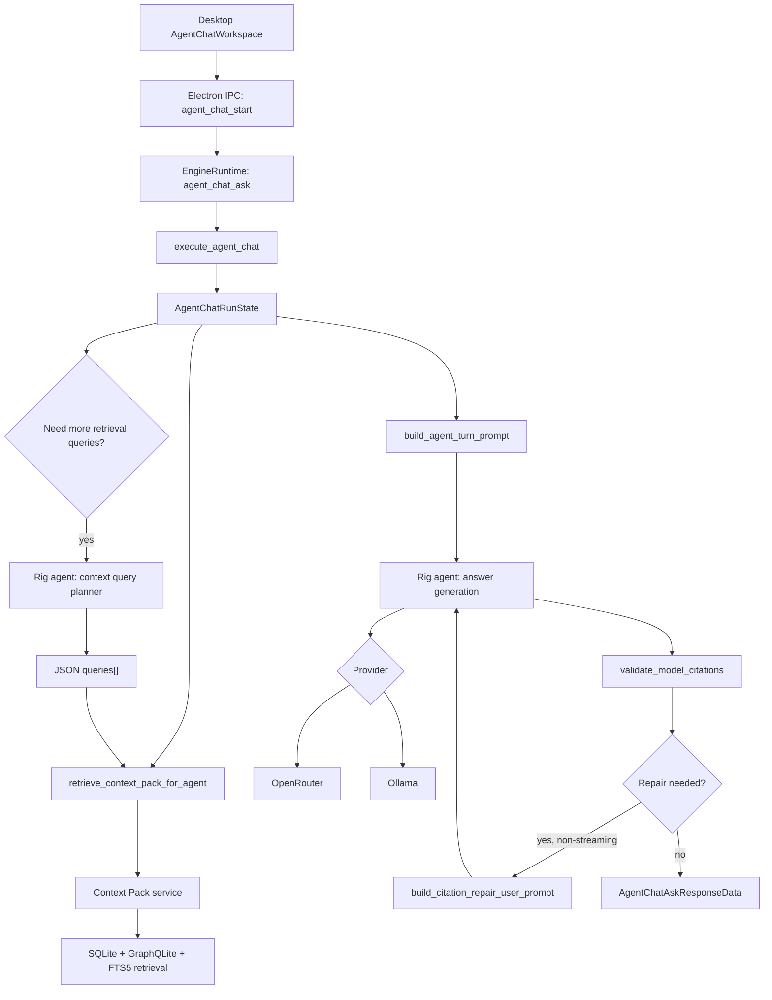
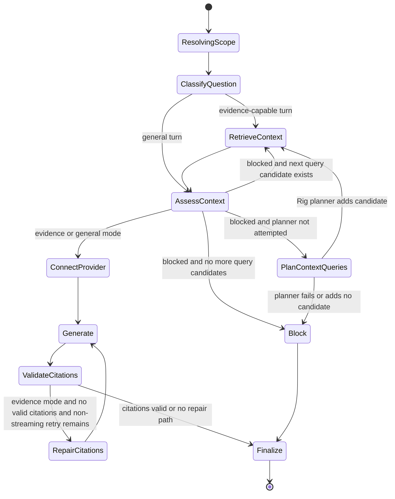
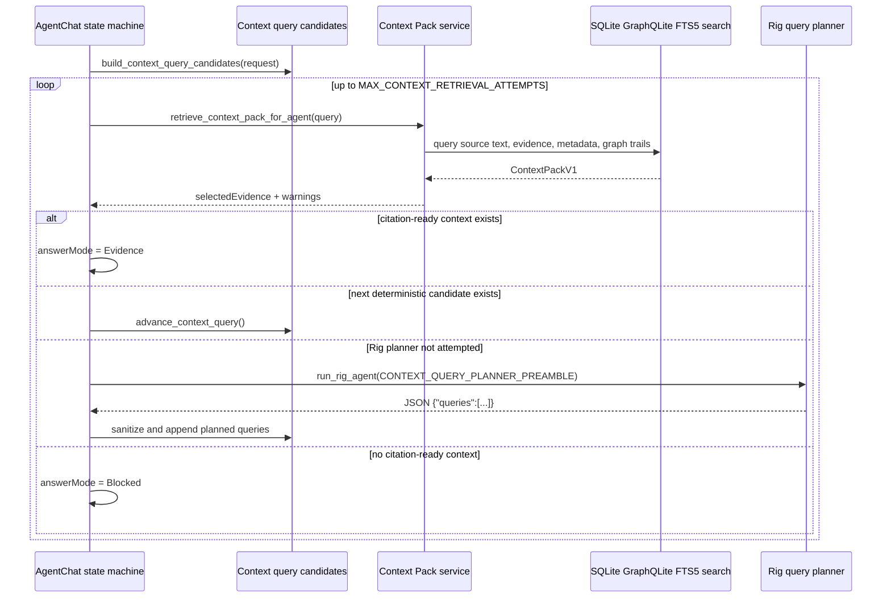
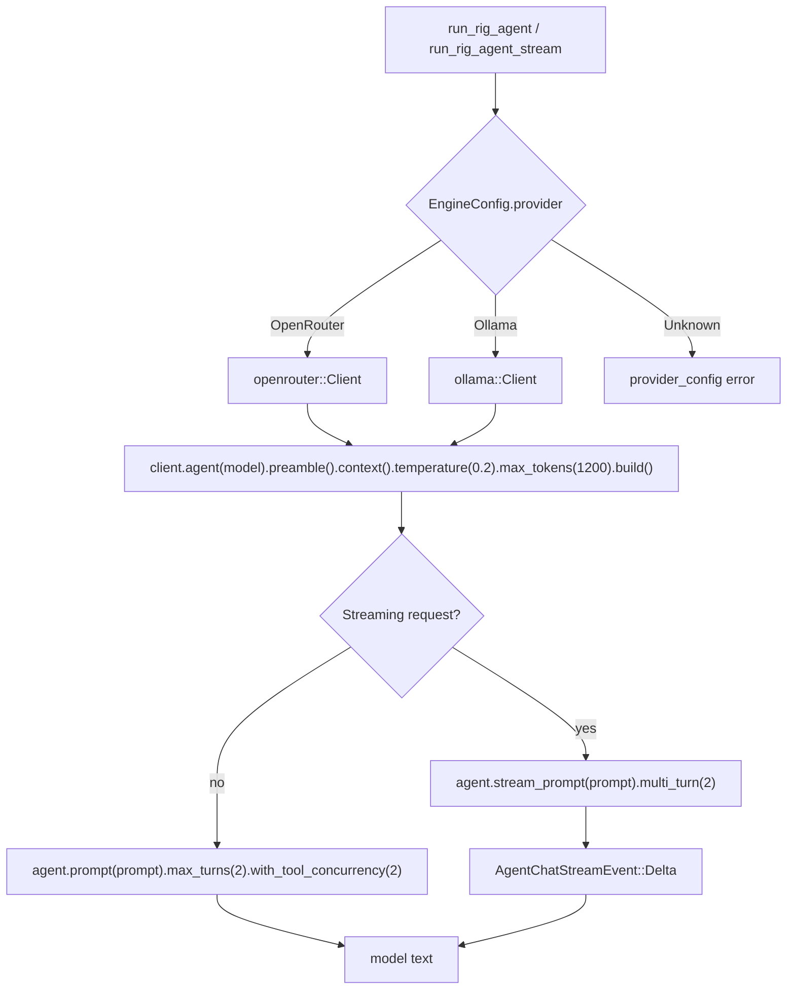
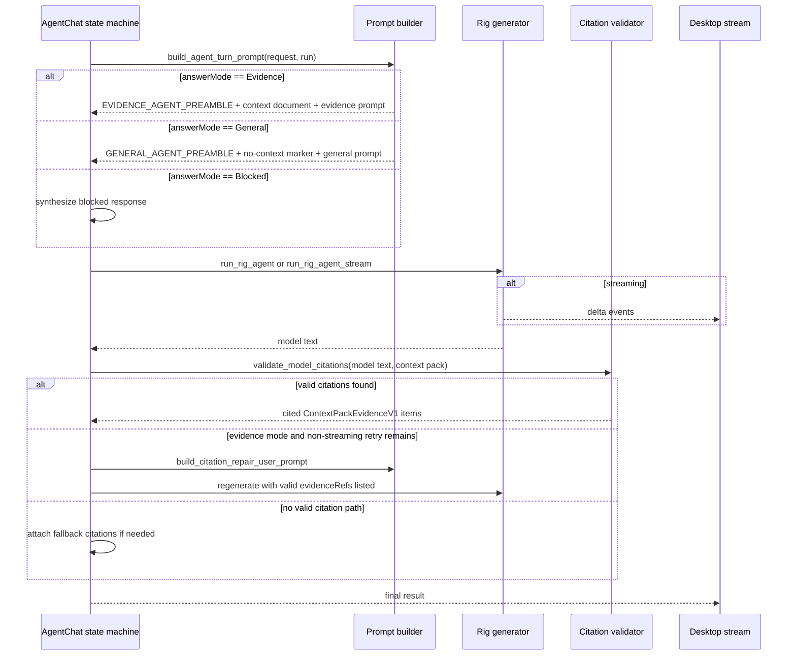
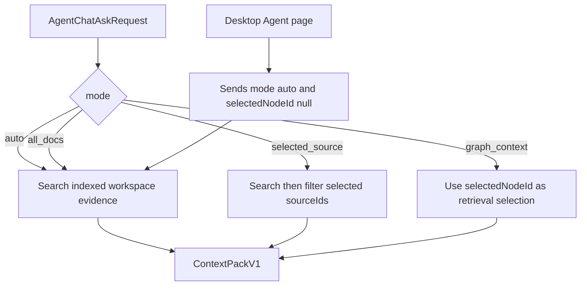

# Agent Chat Rig Workflow

This document describes the current Rig-backed Agent chat workflow implemented
in `crates/etyma-engine/src/application/services/agent_chat_service.rs`.

## Runtime Shape

## State Machine

## Query Planning Loop

## Rig Calls

## Answer Generation And Citation Guard

## Scope Rules

## Design Notes

- The Rust loop is the deterministic controller. Rig is called only for query
  planning and answer generation.
- Query planning is dynamic: it runs only after deterministic query candidates
  fail to produce citation-ready context.
- Evidence prompts include recent user messages only. Prior assistant messages
  are not treated as evidence.
- Citation validation is post-generation and local. Invalid evidenceRefs are
  dropped, and non-streaming evidence answers may be regenerated once with a
  repair prompt.
- The desktop Agent page does not inherit graph selection state. Graph selection
  is inspection state unless an explicit graph scoped request is sent.
